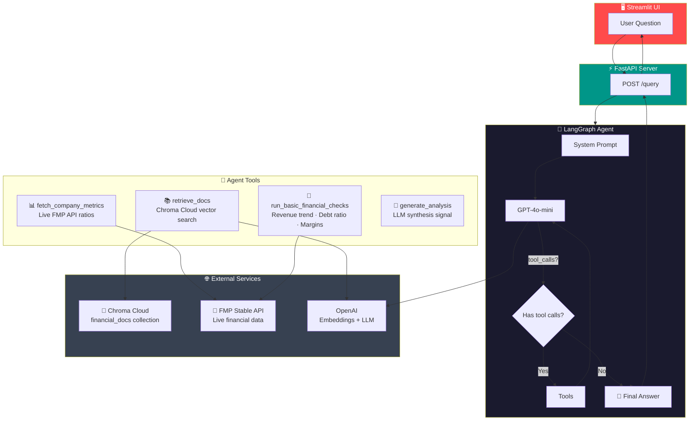
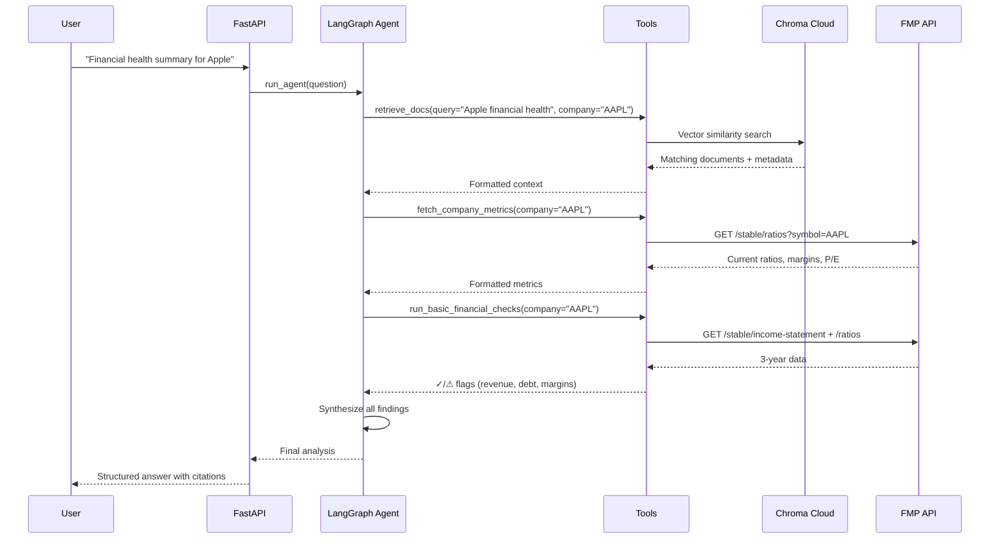

# Financial Analyst Agent

LangGraph-based agent that answers financial questions about companies using RAG (Retrieval-Augmented Generation).

## Architecture



### Agent Workflow



## Setup

1. Copy `.env.example` to `.env` and fill in your keys
2. Install dependencies:
   ```bash
   pip install -r requirements.txt
   ```
3. Make sure you've run the ingestion pipeline (see `financial_data` repo) first

## Run

**Start the API server:**
```bash
uvicorn app.main:app --reload --port 8000
```

**Start the Streamlit UI (separate terminal):**
```bash
streamlit run ui/streamlit_app.py
```

## Example Questions

- "Give me a quick financial health summary for Apple."
- "Why might Nvidia's margins be changing?"
- "Are there any financial risk signals for Microsoft?"
