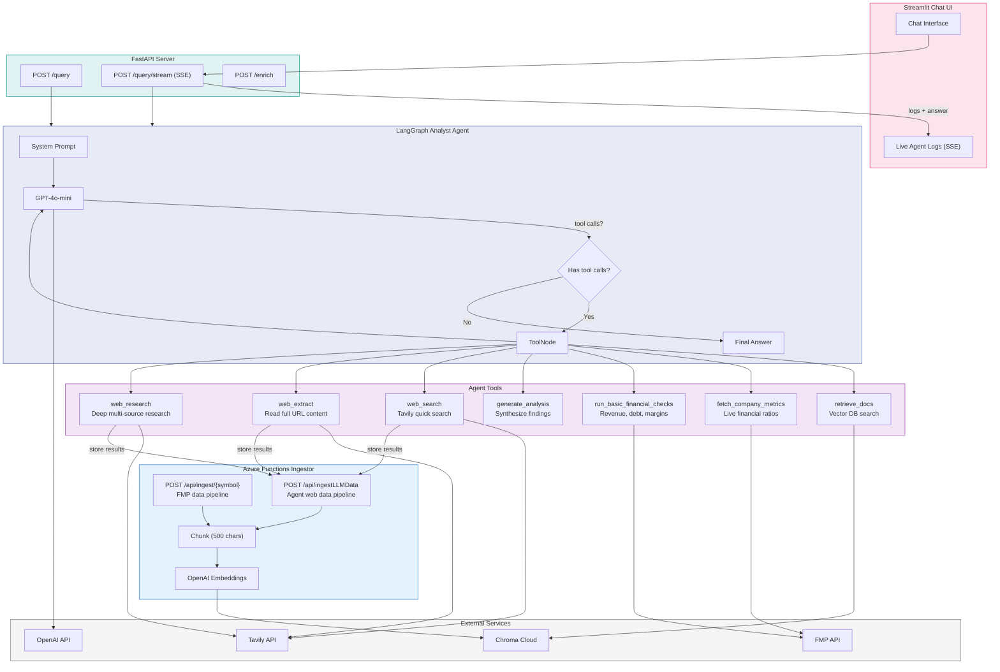
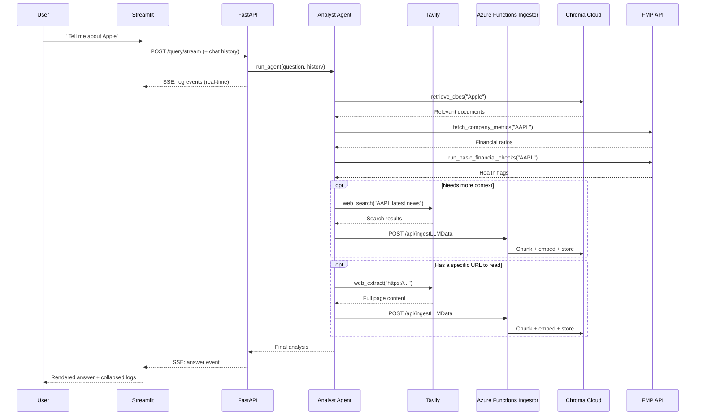

# Company Analyst Agent

LangGraph-based agent that answers questions about companies using RAG, live API data, and web search (Tavily). Features a Streamlit chat UI with real-time agent activity logs.

## Architecture



### Agent Workflow



### Data Enrichment Flow

```mermaid
flowchart LR
    A["Tavily API"] -->|search / extract / research| B["Raw Content"]
    B -->|POST /api/ingestLLMData| C["Azure Functions Ingestor"]
    C --> D["Chunk (500 chars)"]
    D --> E["OpenAI Embeddings"]
    E --> F["Chroma Cloud"]
    F -->|future queries| G["retrieve_docs"]
    G -->|used by| H["Analyst Agent"]
```



## Setup

1. Copy `.env.example` to `.env` and fill in your keys:
   ```
   OPENAI_API_KEY=...
   CHROMA_API_KEY=...
   CHROMA_TENANT=...
   CHROMA_DATABASE=...
   FMP_API_KEY=...
   TAVILY_API_KEY=...
   ```
2. Install dependencies:
   ```bash
   pip install -r requirements.txt
   ```
3. Start the Azure Functions ingestor (see `financial_data` repo):
   ```bash
   cd ../financial_data && func start
   ```

## Run

**Start the API server:**
```bash
uvicorn app.main:app --reload --port 8000
```

**Start the Streamlit UI (separate terminal):**
```bash
streamlit run ui/streamlit_app.py
```

## API Endpoints

| Endpoint | Method | Description |
|----------|--------|-------------|
| `/query` | POST | Ask the analyst agent a question |
| `/query/stream` | POST | SSE stream — logs + final answer |
| `/enrich` | POST | Standalone web enrichment |
| `/health` | GET | Health check |

## Agent Tools

| Tool | Description | Data Source |
|------|-------------|-------------|
| `retrieve_docs` | Search the vector database | Chroma Cloud |
| `fetch_company_metrics` | Live financial ratios (public companies) | FMP API |
| `run_basic_financial_checks` | Revenue, debt, margin checks | FMP API |
| `generate_analysis` | Synthesize findings into analysis | LLM |
| `web_search` | Quick web search | Tavily |
| `web_extract` | Read full content of a URL | Tavily |
| `web_research` | Deep multi-source research | Tavily |
